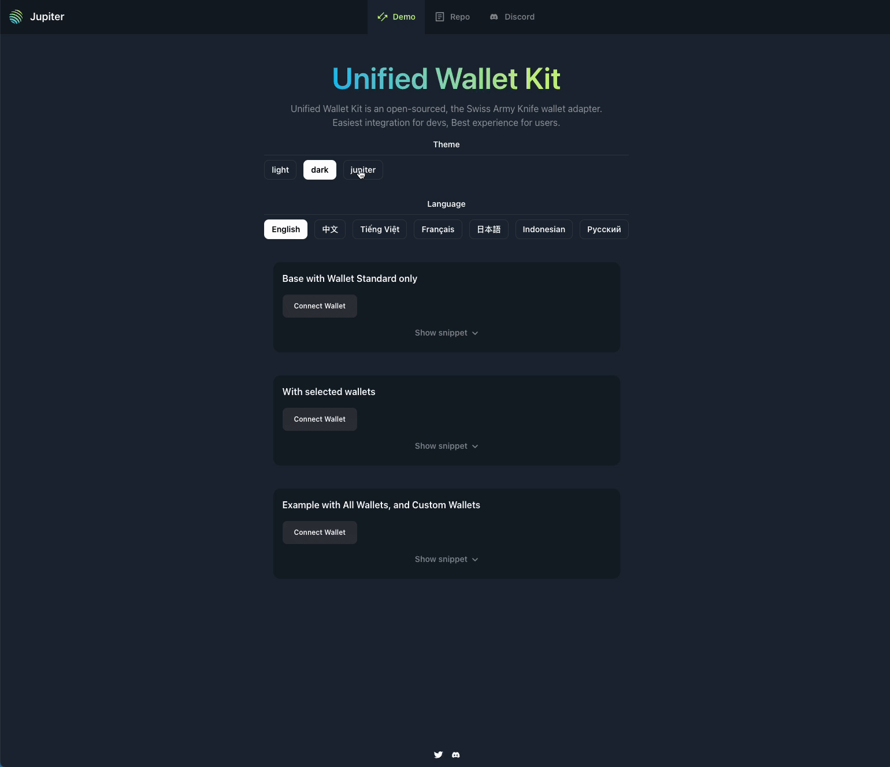

# Unified Wallet Kit

Unified Wallet Kit by Purple Squirrel Media
===========================================

Introduction
------------

Unified Wallet Kit is an open-sourced, comprehensive wallet adapter, designed to deliver an unparalleled wallet integration experience for developers, and a seamless wallet usage experience for users. Together with Terminal, it represents the quickest route to get started on Solana, and is used by notable applications like Jupiter and Meteora.

NPM Package: [https://www.npmjs.com/package/@jup-ag/wallet-adapter](https://www.npmjs.com/package/@jup-ag/wallet-adapter)

Motivation
----------

Why reinvent the wheel? In developing dApps, we often repeat tasks such as notifications for wallet states, auto-reconnection, and ensuring mobile-first, responsive designs. Unified Wallet Kit streamlines this process, providing a cohesive solution that includes theme support and internationalization (i18n).

Philosophy
----------

*   **Sensible Defaults**: Set to streamline the development process.
*   **Lightweight & Fast**: Easy adoption with speedy access.
*   **Extensible**: BYOW (Bring Your Own Wallets) approach for flexibility.
*   **Enhanced Onboarding**: Superior user experience for newcomers.

Core Features
-------------

*   **Compact ESM Bundle**: Main esm bundle at ~94Kb (~20Kb gzipped).
*   **Comprehensive Wallet Support**: Built-in Wallet Standard and Mobile Wallet Adapter support.
*   **Responsive Design**: Optimized for mobile platforms.
*   **Custom Notifications**: Integrated notification system.
*   **Internationalization (i18n)**: Contributions welcome for additional language support.
*   **Theming**: Includes Light, Dark, and Jupiter themes, with more on the way.

Getting Started
---------------

Install using `pnpm i @jup-ag/wallet-adapter` and wrap your app with `<UnifiedWalletProvider />`. Configure it according to your requirements.

Copy code

`const ExampleBaseOnly = () => {   return (     <UnifiedWalletProvider       wallets={[]}       config={{         // Configuration options here       }}     >       <UnifiedWalletButton />     </UnifiedWalletProvider>   ); };  export default ExampleBaseOnly;`

More examples can be found in the demo page or in `src/components/examples`.

More Features
-------------

*   **Wallet Attachment**: Attach custom elements to specific wallets.

FAQs
----

*   **Why selective wallets?**: To avoid bloat and maintain a focus on widely-used and well-maintained wallets.
*   **Notification System**: Optional to allow integration with existing systems. Check `src/components/examples/WalletNotification.tsx` for usage.
*   **Adding/Developing a New Wallet**: We encourage development of Wallets that conform to WalletStandard or MWA for better discoverability.

* * *

_Proudly presented by Purple Squirrel Media_
Message Purple Squirrel NFT Generator…
